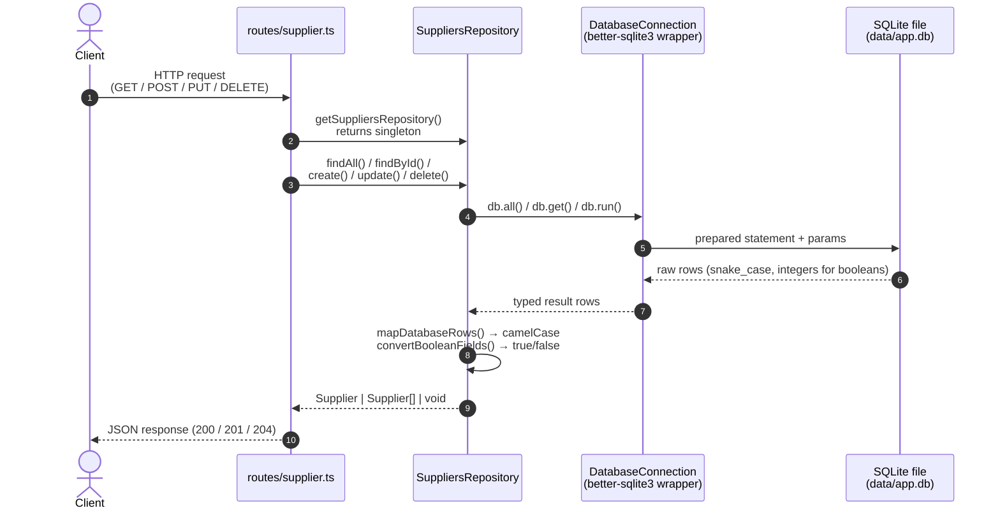
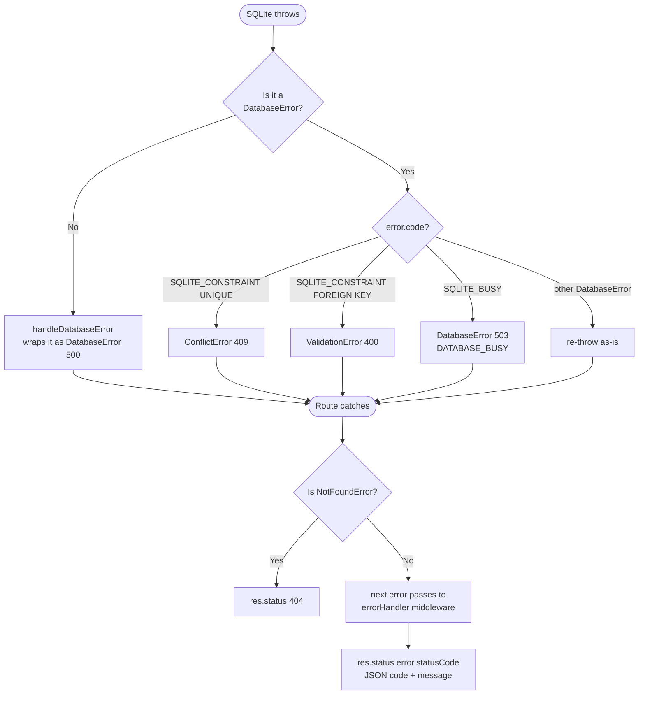
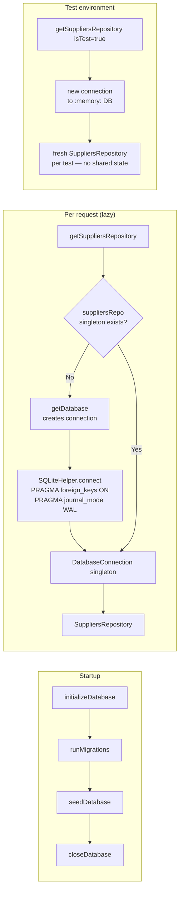

# Suppliers Module – Data Flow

This document describes the end-to-end data flow for the suppliers module,
from an inbound HTTP request through to the SQLite database and back.

---

## Request / Response flow

---

## Error propagation

---

## Repository method map

| HTTP endpoint | Route handler | Repository method | SQL |
|---|---|---|---|
| `GET /api/suppliers` | `router.get('/')` | `findAll()` | `SELECT * FROM suppliers ORDER BY supplier_id` |
| `GET /api/suppliers/:id` | `router.get('/:id')` | `findById(id)` | `SELECT * FROM suppliers WHERE supplier_id = ?` |
| `GET /api/suppliers/:id/status` | `router.get('/:id/status')` | `findById(id)` | `SELECT * FROM suppliers WHERE supplier_id = ?` |
| `POST /api/suppliers` | `router.post('/')` | `create(data)` | `INSERT INTO suppliers (…) VALUES (…)` |
| `PUT /api/suppliers/:id` | `router.put('/:id')` | `update(id, data)` | `UPDATE suppliers SET … WHERE supplier_id = ?` |
| `DELETE /api/suppliers/:id` | `router.delete('/:id')` | `delete(id)` | `DELETE FROM suppliers WHERE supplier_id = ?` |

---

## Connection lifecycle

