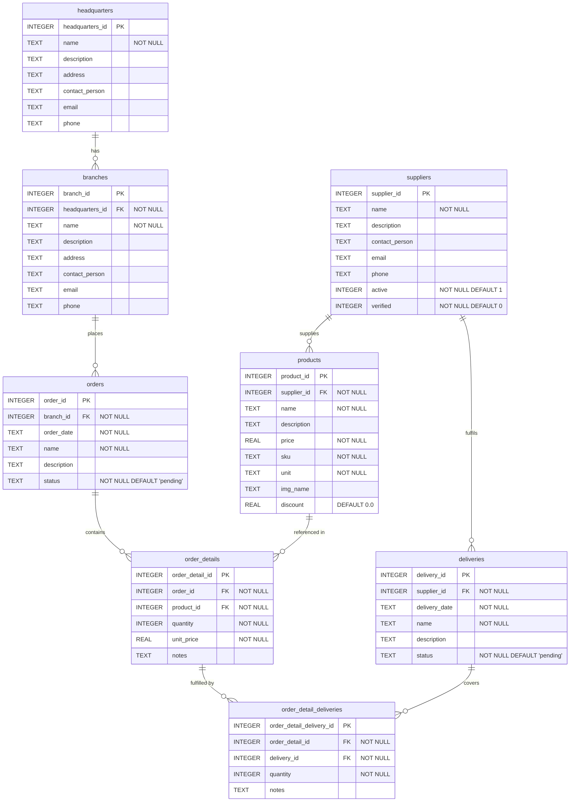

# Database Schema – Entity Relationship Diagram

Generated from migration files:
- `database/migrations/001_init.sql` — core schema
- `database/migrations/002_add_supplier_status_fields.sql` — adds `active` / `verified` to `suppliers`

---

## ERD

---

## Relationship summary

| Parent table | Child table | FK column | Cardinality | On delete |
|---|---|---|---|---|
| `headquarters` | `branches` | `branches.headquarters_id` | 1 : N | CASCADE |
| `suppliers` | `products` | `products.supplier_id` | 1 : N | CASCADE |
| `branches` | `orders` | `orders.branch_id` | 1 : N | CASCADE |
| `orders` | `order_details` | `order_details.order_id` | 1 : N | CASCADE |
| `products` | `order_details` | `order_details.product_id` | 1 : N | CASCADE |
| `suppliers` | `deliveries` | `deliveries.supplier_id` | 1 : N | CASCADE |
| `order_details` | `order_detail_deliveries` | `order_detail_deliveries.order_detail_id` | 1 : N | CASCADE |
| `deliveries` | `order_detail_deliveries` | `order_detail_deliveries.delivery_id` | 1 : N | CASCADE |

> **Note:** `order_detail_deliveries` is a junction table that links `order_details` and `deliveries`,
> representing the many-to-many relationship between order line items and delivery shipments.

---

## Index inventory

| Index name | Table | Column(s) |
|---|---|---|
| `idx_branches_headquarters_id` | `branches` | `headquarters_id` |
| `idx_products_supplier_id` | `products` | `supplier_id` |
| `idx_products_sku` | `products` | `sku` |
| `idx_orders_branch_id` | `orders` | `branch_id` |
| `idx_orders_status` | `orders` | `status` |
| `idx_order_details_order_id` | `order_details` | `order_id` |
| `idx_order_details_product_id` | `order_details` | `product_id` |
| `idx_deliveries_supplier_id` | `deliveries` | `supplier_id` |
| `idx_deliveries_status` | `deliveries` | `status` |
| `idx_order_detail_deliveries_order_detail_id` | `order_detail_deliveries` | `order_detail_id` |
| `idx_order_detail_deliveries_delivery_id` | `order_detail_deliveries` | `delivery_id` |
